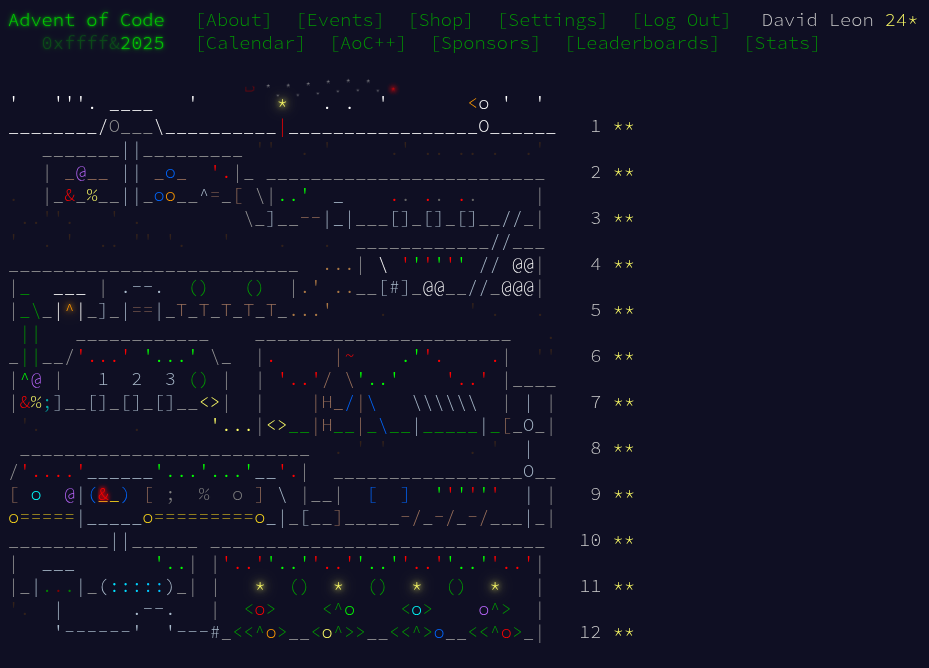

# Advent of code 2025

## Getting started

Every December, programmers around the world gather to save Christmas—one line
of code at a time. Advent of Code is an Advent calendar of small programming
puzzles for a variety of skill sets and skill levels.

For 2025, I’ve decided to take on the challenge of sharpening my algorithms,
just for fun. It’s not just about getting the correct answer; it’s about the
journey, the community, and the satisfaction of solving complex problems.

Follow along as I document my progress, frustrations, and breakthroughs in this
repository throughout the month!

I'm using <https://pypi.org/project/adventofcode/> for the scaffolding.

## Finished

## Benchmark Results

<!-- BENCHMARK_RESULTS_START -->
| Day | Status | Part 1 Time | Part 2 Time | Total Time |
|----:|:------:|------------:|------------:|-----------:|
| 01 | ✅ | 1.30ms 🟢 | 2.06ms 🟢 | 3.36ms 🟢 |
| 02 | ✅ | 665.15ms 🟡 | 6.76s 🔴 | 7.43s 🔴 |
| 03 | ✅ | 230.22ms 🟡 | 48.64ms 🟢 | 278.86ms 🟡 |
| 04 | ✅ | 16.26ms 🟢 | 687.29ms 🟡 | 703.55ms 🟡 |
| 05 | ✅ | 4.89ms 🟢 | 0.14ms 🟢 | 5.03ms 🟢 |
| 06 | ✅ | 4.37ms 🟢 | 5.48ms 🟢 | 9.85ms 🟢 |
| 07 | ✅ | 2.08ms 🟢 | 1.56ms 🟢 | 3.64ms 🟢 |
| 08 | ✅ | 929.38ms 🟡 | 894.60ms 🟡 | 1.82s 🔴 |
| 09 | ✅ | 74.28ms 🟢 | 431.89ms 🟡 | 506.17ms 🟡 |
| 10 | ✅ | 388.16ms 🟡 | 874.49ms 🟡 | 1.26s 🔴 |
| 11 | ✅ | 0.23ms 🟢 | 1.44ms 🟢 | 1.67ms 🟢 |
| 12 | ✅ | 2.59ms 🟢 | - | 2.59ms 🟢 |
| **Total** | | 2.32s 🔴 | 9.71s 🔴 | 12.03s 🔴 |

Legend:

* 🟢 < 100ms
* 🟡 100ms - 1s
* 🔴 > 1s
* ⚪ Not included in total
<!-- BENCHMARK_RESULTS_END -->
